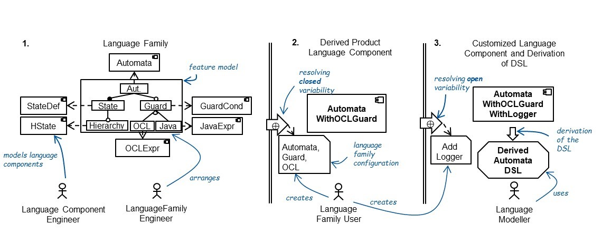
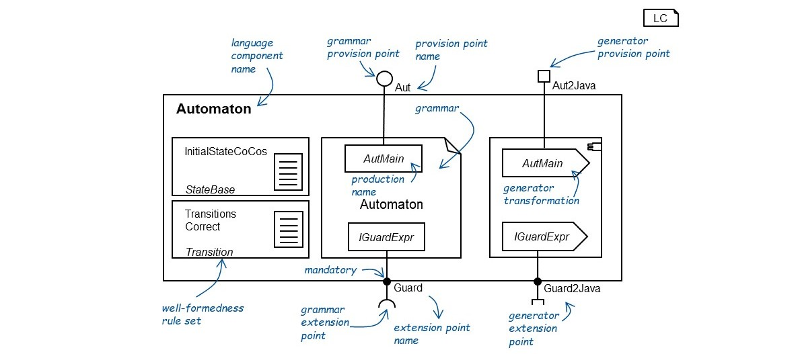
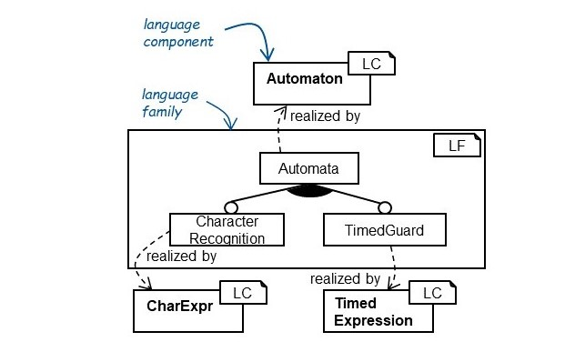
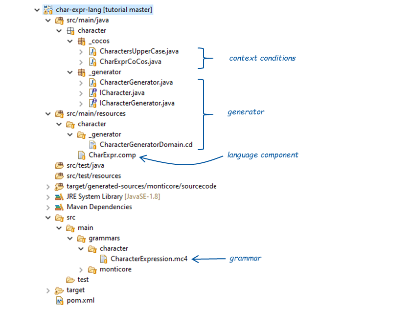

# SCOLAR Tutorial

## 1. Overview

Domain-specific languages (DSLs) bridge the gap between problem space in which the domain experts work and the solution space, i.e., the technical realization. They abstract from the details of the solution space and thus, they greatly improve comprehensibility and reduce the proneness for errors. Language workbenches facilitate the development of DSLs with supportive tooling, such as automatic parser or editor derivation. However, the development of such DSLs is still complex due to the lack of practicable methods or syntax and semantics reuse and customization. The existing approaches require knowledge of specific technological spaces or do not provide integrated support for language variability and customization.

This tutorial presents SCOLAR, a framework for systematic component-based language reuse of textual, external and translational DSLs. It realizes closed variability and customization of languages on a level independent from the technological space and employs reusable language components that represent pieces of languages. A selection of language features represents closed variability and is contained in a language family. Language components have an interface that enables customization. Configuring language families and customizing language components allow the derivation of new DSLs. Hence, SCOLAR fosters reuse of languages and facilitates designing new DSLs via closed variability, customization, and
the composition of independent, reusable language components.

In this tutorial, you will learn how to use SCOLAR with MontiCore. This includes the creation of language components, and defining a language family and its configuration.

### 1.1 Resources

The tutorial project is structured as follows:

- `tutorial`
  - `code`
    - `automata-lang` contains a automaton language and a SCOLAR component.
    - `char-expr-lang` contains a char expression language and a SCOLAR component.
    - `timed-expr-lang` contains a timed expression language and a SCOLAR component.
    - `language-family` contains the automaton language family, that employs the components above
    - `usage` contains a configuration for the language family from the project `language-family`.


This tutorial requires:

- Java 11
- Gradle 8.2
- MontiCore 7.5.0

### 1.2 The SCOLAR Development Process

In SCOLAR, language engineering is separated in language family engineering, in which someone preconfigures possible language variants through a feature model, resolving closed variability by selecting features, and resolving open variability by adding unforeseen language components.

**Figure 1.1:** *The SCOLAR Process consisting of three steps, that include the definition of language components, creating a language family, configuring it, and customization to get a usable DSL.*

Figure 1.1 gives an overview of the SCOLAR language development process. The first step of the SCOLAR process includes the creation of language components and building a language family from a selection of language components. The language family comprises a feature diagram where each feature is realized through a language component. In the second step, the language family is configured and a language component is derived. This language component can be customized via its customization interface in the third step. The result of the process can be a usable DSL.  

The following presents the participating elements of the SCOLAR process.

### 1.3 Language Components

Language components encapsulate a language or parts of a language such that they become reusable in different contexts and language families. They comprise a Monticore grammar,  sets of well-formedness rules, and model-to-text transformations in the form of code generators. Figure 1.2 shows the component `Automaton`. It contains the well-formedness rule sets `InitialStateCoCos` and `TransitionsCorrect`. Furthermore, it references the grammar `Automaton` and comprises generator transformations for the grammar rules `AutMain` and `IGuardExpr`.  A language component always has an interface that includes extension points, provision points, and well-formedness rule sets.



**Figure 1.2:** *The graphical representation of the language component* `Automaton` *and its interface.*

##### Elements of Language Components

Aside from language definition constituents, language components comprise:

- **Extension points** indicate missing functionality of the component, e.g., the component `Automaton` requires a grammar rule that implements the interface rule `IGuardExpr` and a generator transformation for this rule. Eps can be either optional or mandatory. When they are mandatory, an implementation for the extension point has to be provided to derive a DSL from the component. 

- **Provision points** offer functionality to be reused by other components. Grammar provision points reference a production in the grammar that can be reused by other components grammars. Generator provision points reference a grammar rule, which they provide a transformation for. For example, the component `Automaton` offers a rule and a generator for`AutMain` via the provision points `Aut` and `Aut2Java` respectively. A well-formedness rule set references exactly one grammar production and represents arbitrary many well-formedness rules for this production or any transitively reachable productions. Well-formedness rule sets can be extended by well-formedness rule sets from other components or they can be reused in other components. 

Through these, language components can be composed according to the feature model (closed variability) or customized with unforeseen extensions (open variability). 

<!---TODO: ist das customization interface noch relevant?--->

The **customization interface** contains all grammar and generator extension points of a language component. Unlike the language family, it realizes open variability. This means, technology-specific extensions or extension with constituents that are not available or not provided by the language family, It can be configured using a customization configuration.

<!---TODO: Der nachfolgende Satz ist kaputt--->

The **customization configuration** references language components, configuring the customization interface and arbitrary many providing components that provide functionality that can be bound to the extension points of the customized component. 

### 1.4 Composing Language Components

Language components are composed using **bindings**. A binding connects two components. It is a directed relation from one or more constituents of a providing component to one constituent of an embedding component. It loosely follows the notion of language embedding ([MontiCore reference manual](http://monticore.de/MontiCore_Reference-Manual.2017.pdf), p. 94) but extends this to context conditions and code generators. SCOLAR currently supports four kinds of bindings between different language definition constituents:

1. A **grammar binding** is a mapping from a grammar provision point of the providing
   component to a grammar extension point of the embedding component. The notation
   of this mapping is:
   
   <!---TODO: Notation ein wenig früh, da man noch keine andere konkrete syntax gesehen hat? Ggf. vorher Modelle zeigen oder hier Notation entfernen.--->
   
   `production <name of the provision point> --> <name of the extension point>` .
2. A **generator binding** is a mapping of a generator provision point of the providing
   component to a grammar extension point of the embedding component. The notation
   of this mapping is:
   
    `gen <name of the provision point> --> <name of the extension point>` .
3. A **well-formedness rule binding** merges a well-formedness rule set of the providing
   component into a specific well-formedness rule set of the embedding component.
   The notation of this mapping is:
   `wfrs <name of the provided well-formedness rule set> --> <name of the embedding well-formedness rule set>.`
4. A **well-formedness rule insertion binding** adds a well-formedness rule set of the providing
   component to the embedding component. The notation of this mapping is:
   `wfrs <name of added well-formedness rule set>`.

Bindings can be defined in the customization configuration and the feature definition in the language family. 

### 1.5 Language Families

In SCOLAR, language families represent a product line of languages. A language family references a set of language components and consists of a feature diagram and a set of bindings. The feature diagram is a hierarchical tree of features. Each feature is implemented by a language component. For each feature, a binding describes the relations between the provided elements of the realizing component to the realizing component of the parent feature. If a feature is selected, all defined bindings for the feature are applied and the two language components are composed. Because the root feature has no parent feature, there is the possibility to define a binding in the feature definition. 

## 2. The Automaton Language Family

In this tutorial, we develop a language family for automatons. Figure 3 shows the graphical representation of the language family `Automataton Family`. It contains a feature diagram that consists of three features. The root feature `Automata` provides basic language elements of an automaton language such as states and transitions. The family allows to select from two kinds of guards. Either the guard recognizes certain character by selecting the feature `CharacterRecognition` or the guard is fulfilled after a certain time has passed. This can be activated by selecting the feature `TimedGuard`. Each feature of the language family is realized by a corresponding language component. The feature `Automata` is realized by the component `Automaton`, the feature `CharacterRecognition` is realized by the component `CharExpr` and the feature `TimedGuard` is realized through the language component `TimedExpression`.



**Figure 3:** *The language family* `Automaton Family` *with the feature diagram describing the language product line and the feature realizing language components.*

The following sections explain how to define language components, how to develop a language family and how to configure it.

## 3. Defining Language Components: The Character Expression Language Component

**NOTE:** This sections resources are located in the folder `./code/char-expr-lang`.

<!---TODO: Der Pfad stimmt nicht. Vom Pfad der README aus, wäre das ./code/char-expr-lang. Bitte hier und ggf. anderen Stellen anpassen.--->

TODO: Eine Parent POM zum importieren aller Projekte wäre nett

### 3.1 Project Structure

A typical language component project with all three constituents, i.e., grammar, well-formedness rules, and generator transformations looks as displayed in Figure 3.1. 



**Figure 3.1:** *The project structure of the language project for the character expression language. It contains a grammar, context conditions, a generator and a language component.*

The figure shows the project of the language component `CharExpr`. In the project structure, all artifacts referenced by the language component can be found. In the top-most section resides a context condition `CharactersUpperCase`. The class `CharExprCoCos` is responsible for the creation of all well-formedness rule sets of the language component. For this purpose, it provides creation methods for each set. In the package `_generator`, the generator classes are defined. A generator has to have at least define a generator class, a producer interface and a product interface [[BEK+18b](https://www.se-rwth.de/publications/Modeling-Language-Variability-with-Reusable-Language-Components.pdf)]. In this case, the generator class is `CharacterGenerator`, the product interface is `ICharacter` and the producer interface is`ICharacterGenerator`. All these classes and their relations are described in the class diagram `CharacterGeneratorDomain`. In the folder `src/main/grammars` resides a MontiCore grammar `CharacterExpression` that defines the abstract and concrete syntax of the language piece. The generator and the context conditions are written against the rules of the grammar. Furthermore, the language component can specify rules that it wants to provide or that need extension.

The model of the language component is defined by the file `CharExpr.comp`.

### 3.2 The Language Component Model

```
package characterexpression;

import context character._generator.CharacterGeneratorDomain.*;
import character.characterexpression.cocos.*;

language component CharExpr {
  grammar character.CharacterExpression;

  provides production Char for CharacterRule;

  provides gen CharacterGenerator for CharacterRule {
    generator CharacterGenerator;
    producer ICharacterGenerator;
    product ICharacter;
  }

  wfrs UpperCaseCharacters for CharacterRule {
    CharactersUpperCase;
  }
}
```

**Listing 3.1:** *The source code for the language component* `CharExpr` 

<!---TODO: Kann man die vollqualifizierten Namen (hier und im Projekt) kürzen? Kommentare im Listing wären toll.--->

A file of the component model resides in a package. Its name is declared in the top of the model. The component definition starts with the keywords `language component` followed by the name of the component. This name is identical to the name of the file. The name of the grammar is specified after the keyword `grammar`.  

A provision point for the grammar is defined by the keywords `provides production` followed by the name of the provision point and the fully qualified name of the rule. For instance, in Listing 3.1, the provision point `Char` references the rule `CharacterRule` of the grammar `CharacterExpression` in package `characterexpression`. A grammar extension point is defined similar, despite that the keyword `provides production` has to be replaced with the keywords `requires production`. Additionally, the grammar extension point must be defined as `mandatory` or `optional`.

Generator extension and provision points start with the keyword `provides gen`. They also state whether they are extension or provision point and define a name and a grammar rule the particular transformation works for.  Furthermore, a triple of three classes have to be defined. This includes a generator class, a producer interface, and a product interface. All of the classes have to be contained in the domain model. 

Well-formedness rule sets start with the keyword `wfrs` followed by the name of the set and the grammar rule they check. In the body of the definition, the contained context condition classes are stated with their fully qualified name. 

In the following sections, the realization of the different artifacts that are referenced in this component model are described. 

### 3.3 Artifacts realizing the component

#### Defining Generators

A generator that is to be used in a language component has to comprise at least three classes. A generator class, a producer interface, and a product interface. The Producer and Product interface are defined for one nonterminal of the grammar. For instance, an implementation of interface `ICharacterGenerator` has to implement a producing method for the grammar rule `CharacterRule`. With the generator class we distinguish two cases:

1. The generator class is used in provision point definition. This is the case with the `CharacterGenerator`. In this case, the generator has to implement the producer interface that corresponds to the grammar rule referenced by the provision point. In the provision point of component `CharExpr` this is the interface `ICharacterGenerator`. 
2. The generator is used in  an extension point. In this case, the generator does not implement the producer interface of the referenced grammar rule. Instead, the generator class has to contain a Map with key of type `Class` and the value of the type of the producer interface of the referenced grammar rule. An example of this is the generator class `AutGenerator` of component `Automaton`. Also, the generator class has to provide a register method to add embedded generators to the map. 

Important is, that each generator has to produce a single artifact. This artifact has to implement the product interface of the referenced grammar rule. For instance, the generator `CharacterGenerator`is able to process AST classes for the grammar rule `CharacterRule` and produces a Java class that implements the  rules product interface `ICharacter`.

#### Defining WFR Sets

When a language component contains well-formedness rule sets, it has to define a class with the name of the component followed by the keyword `CoCos`. For instance, the component `CharExpr` defines a class `CharExprCoCos`. This class is responsible for creating all well-formedness rule sets of the component. It contains a creation method with the name `create` followed by the name of the well-formedness rule set. Since the component `CharExpr`, contains only one set `UpperCaseCharacters` the class contains a method `createUpperCaseCharactersChecker()` that returns a checker for the grammar rule referenced by the set. In the body of the method, all context conditions that are contained in the set are added to the returned checker. There are no constraints when it comes to the implementation of context conditions in MontiCore.

#### Defining Grammars

The grammar of language components is usual MontiCore grammars. To use a rule in a provision point it must not be an interface rule or abstract rule. When a grammar rule is to be used as a extension point it has to be an interface rule. The grammar `CharacterExpression` defines only one rule which is used as a provision point of the component.

## 4. Defining the Automaton Language Family

**NOTE:** This sections resources are located in the folder `tutorial/code/automaton-family`.

This section describes how to define the language family in SCOLAR. The family resides in a package that is defined in the head of the model. Then the family definition follows. It starts with the keywords `family` followed by the name of the family. The body consists of two parts:

1. The definition of the feature diagram.
2. The feature definition that connects the imported language components with the features of the feature diagram they realize.

<!---Language components are imported in the body of the construct that starts with the keyword `language components`. The components are referenced through their fully qualified name which includes the package and the name of the component. For instance, the component `characterexpression.CharExpr` (cf. Listing 4.1), that we have seen earlier in the tutorial is imported.--->

```
package autfam;

family AutomatonFamily {

  featurediagram Automata{
    Automata -> CharacterRecognition ^ TimedGuard;
  }

  feature Automata {
    component aut.Automaton;
    
    select production Aut;
    select wfrs TransitionsCorrect;
    select gen Aut2Java;
  }
  
  feature CharacterRecognition {
    component character.CharExpr;
    
    production Char                   -> Automata.Guard;
    gen        CharacterGenerator     -> Automata.Guard2Java;
    wfrs       UpperCaseCharacters;
  }
  
  feature TimedGuard {
    component timedexpr.TimedExpression;
    production Clock -> Automata.Guard;
    wfrs TimeCorrectnessChecks;
    gen TimedExprGenerator -> Automata.Guard2Java;
  }
}
```

**Listing 4.1:** *Source code of the language family* `AutomatonFamily`.


The definition of the feature diagram starts with the keyword `featurediagram` followed by the name of the root feature. After that, each new level of hierarchy in the feature tree is introduced by curly brackets. A feature is declared by giving its name. The first declared feature must be the root feature again. Depending on its optionality the name is prefixed with the symbol `?` for optional or no symbol for `mandatory`. Alternatives or logical conjunctions declare the symbols `&` for and, `^` for xor, or `|` for or between the corresponding features. The feature diagram of the family `AutomatonFamily` (see Listing 4.1) declares the feature `Automata` as root feature. A level below either a guard that recognizes characters or a guard that holds after a certain time can be selected via the features `CharacterRecognition` or `TimedGuard`, respectively.

To this time, we do not know which feature is realized through which component and how they relate to each other regarding their interfaces. For this, we need the feature definition. For each feature, there must be a feature definition. A feature definition can either be a root configuration or defines the bindings between realizing language components. It always starts with the keyword feature followed by the name of the feature. For instance, the root feature `Automata` is declared above. In the definition of the root feature, a set of provision points and well-formedness rule sets that should be available after the configuration, i.e., the composition, can be defined. The feature `Automata` selects the grammar provision point `Aut`, the well-formedness rule set `TransitionsCorrect`, and the generator provision point `Aut2Java`.  All feature definitions have to reference a component they are realized through, e.g., the feature `Automata` is realized through the component `aut.Automaton`. Furthermore, non-root features have to define at least one binding between its realizing component and the realizing component of its parent feature. Consider the definition of the feature `CharacterRecognition`. It is realized by the component `character.CharExpr`. The feature defines three kinds of bindings. First, it binds the grammar provision point `Char` to the extension point `Guard` of the parent feature's realizing component `Automata`. Besides, the definition adds the well-formedness rule set `UpperCaseCharacters` and binds the generator provision point `CharacterGenerator` to the extension point `Guard2Java`.

## 5. Configuring Language Families

**NOTE:** This sections resources are located in the folder `tutorial/code/usage`.

The configuration of a language family selects a set of features from the feature diagram of the language family. In the project `usage` in the folder `src/main/resources` in package `autfam`, you can find the configuration model for the language family `AutomatonFamily`. It selects the features `Automata` and `CharacterRecognition`. To apply the configuration, you just have to run `./gradlew clean build` in the project root where the build.gradle resides. Within the test `LanguageFamilyTest`, which is located in the folder `src/test/java` in the package `autfam`, the configuration is read and the components are composed. You can find the generated, i.e., composed artifacts in the folder `usage/target/test-results/automatonexample`. 
